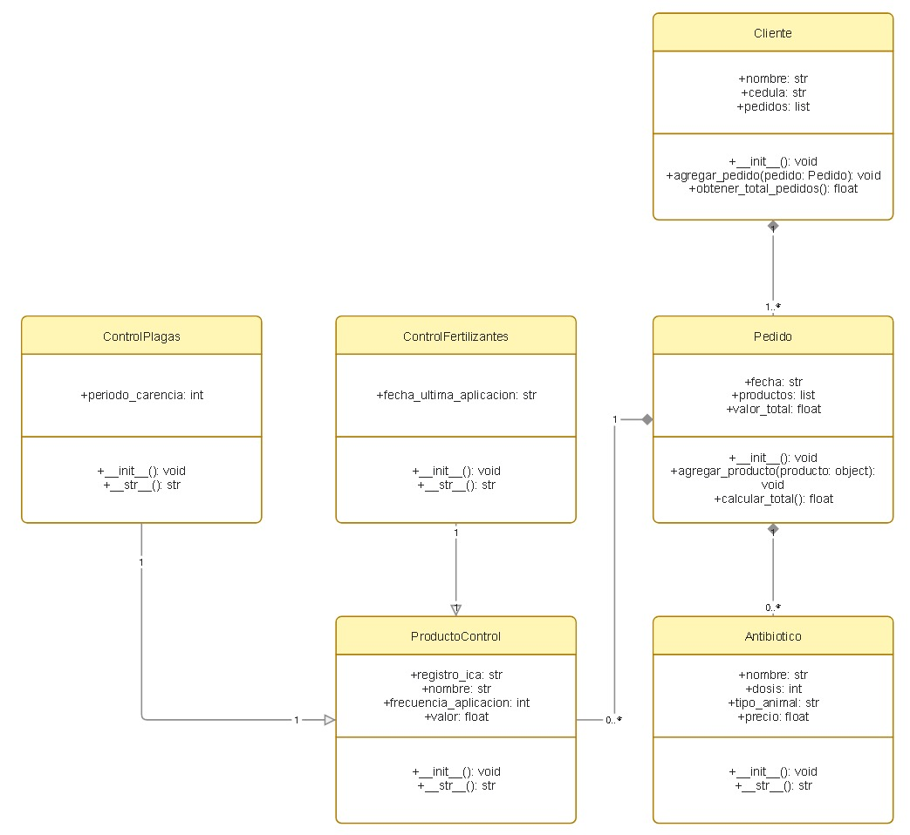
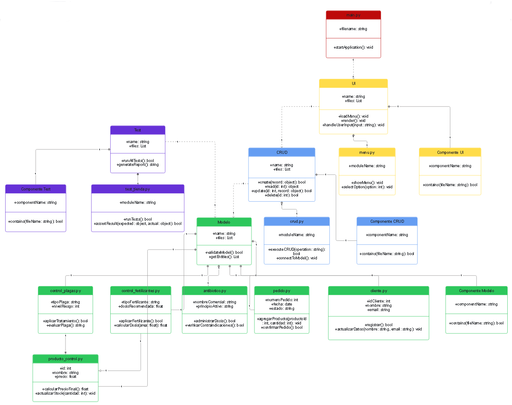
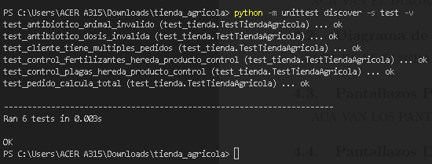
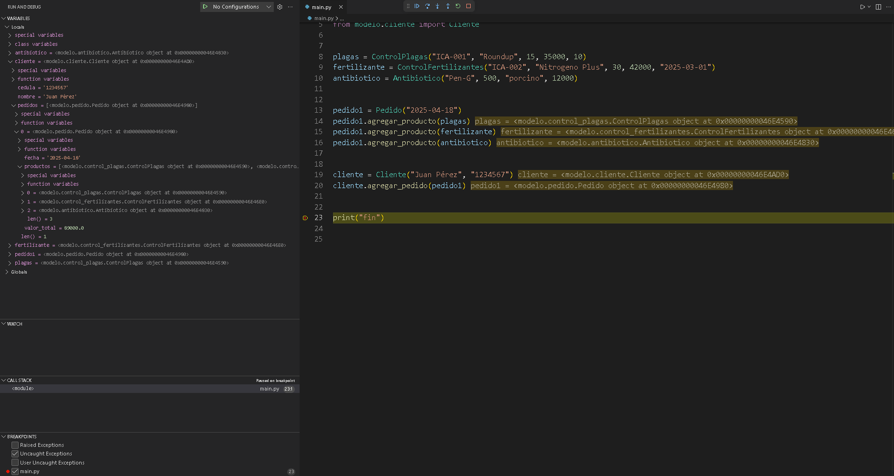
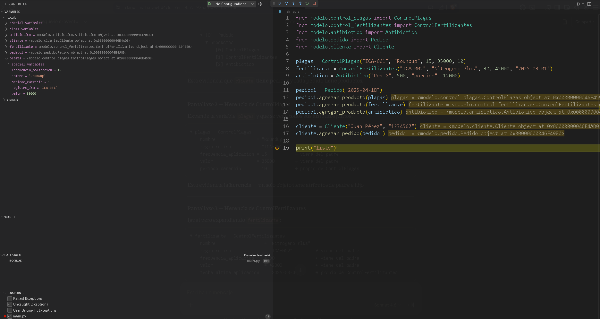
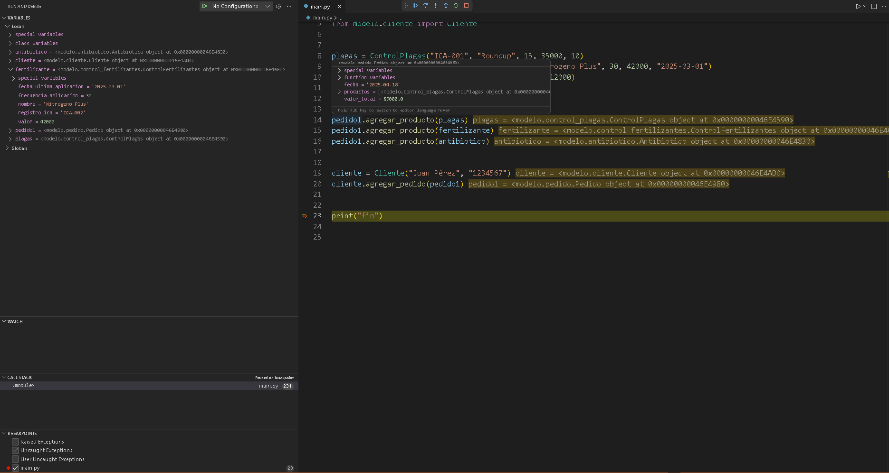

# Tienda Agrícola - Sistema de Facturación

---

## Descripción

Sistema de facturación para una tienda agrícola desarrollado en Python. Permite gestionar clientes, pedidos y productos especializados como controles de plagas, fertilizantes y antibioticos para animales de granja.

El proyecto se enfoca principalmente en la aplicacion de los conceptos de **herencia**, **composición** y **modularidad**.

---

## Estructura del Proyecto

```
tienda_agricola/
│
├── modelo/
│   ├── __init__.py
│   ├── producto_control.py
│   ├── control_plagas.py
│   ├── control_fertilizantes.py
│   ├── antibiotico.py
│   ├── pedido.py
│   └── cliente.py
│
├── crud/
│   ├── __init__.py
│   └── crud.py
│
├── ui/
│   ├── __init__.py
│   └── menu.py
│
├── test/
│   ├── __init__.py
│   └── test_tienda.py
│
├── main.py


```

## Diagrama de Clases



---

## Diagrama de Componentes



---

## Cómo correr las pruebas

Desde la carpeta raíz del proyecto ejecutar:

```bash
python -m unittest discover -s test -v
```

---

## Evidencias

### Pruebas Unitarias



---

### Debug — Composición (Cliente → Pedido → Productos)



---

### Debug — Herencia ControlPlagas



---

### Debug — Herencia ControlFertilizantes



